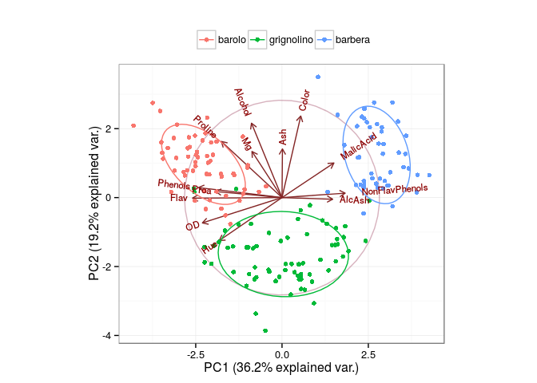
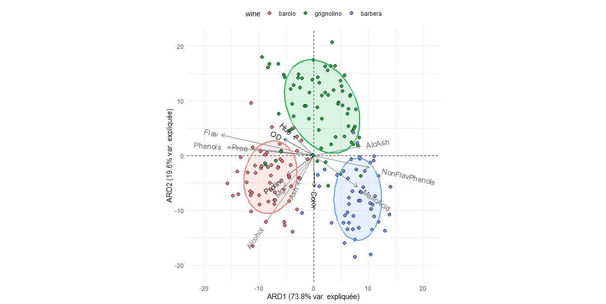

<!-- README.md is generated from README.Rmd. Please edit that file -->

**NEWS**: Active development of ggbiplot has moved to the [experimental branch](https://github.com/vqv/ggbiplot/tree/experimental)

ggbiplot
========

An implementation of the biplot using ggplot2. The package provides two functions: `ggscreeplot()` and `ggbiplot()`. `ggbiplot` aims to be a drop-in replacement for the built-in R function `biplot.princomp()` with extended functionality for labeling groups, drawing a correlation circle, and adding Normal probability ellipsoids.

*The development of this software was supported in part by NSF Postdoctoral Fellowship DMS-0903120*

Installation
------------

``` r
library(devtools)
install_github("salix-d/ggbiplot")
```

Example Usage
-------------

``` r
library(ggbiplot)
data(wine)
wine.pca <- prcomp(wine, scale. = TRUE)
ggbiplot(wine.pca, obs.scale = 1, var.scale = 1,
  groups = wine.class, ellipse = TRUE, circle = TRUE) +
  scale_color_discrete(name = '') +
  theme(legend.direction = 'horizontal', legend.position = 'top')
```



``` r
library(ggbiplot)
library(vegan)
data(wine)
wine.rda <- rda(wine[1:9], wine[10:13], scale = T)
ggtriplot(wine.rda, obs.scale = 1, var.scale = 1, choices = c(1,2), 
          var.arrow.color = '#696969', var.arrow.scaling = 1.5, varname.size = 4, 
          bi.arrow.color = '#121212', bi.arrow.scaling = 1, biname.size = 5, 
          ellipse = TRUE, ellipse.type = 't', axes.lang = 'FR',
          groups = wine.class) +
  xlim(-21,21) + ylim(-21,21) +
  guides(fill = guide_legend('wine')) +
  theme(legend.direction = 'horizontal', legend.position = 'top')
  ```
  
